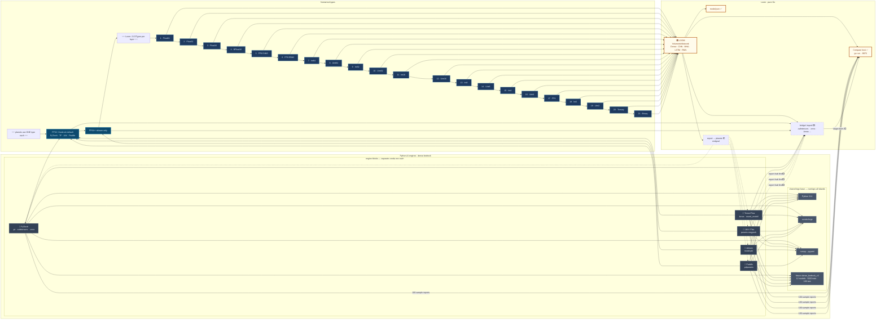
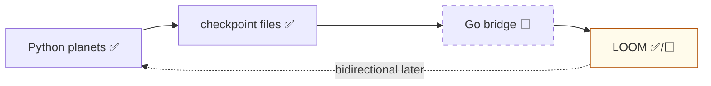
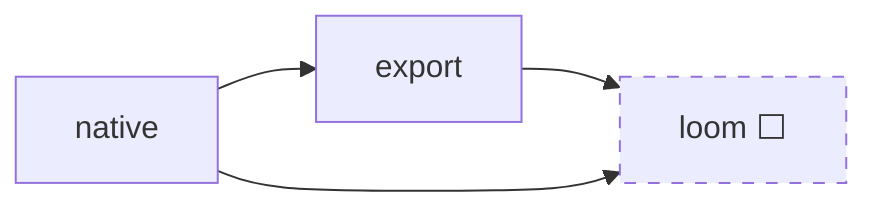

# Planet Bridging — architecture diagram

**End goal:** **bidirectional** — planets ↔ hub formats ↔ **Loom** (import and export).

**Step 1 (now):** **one direction only** → planets train in Python, checkpoints hit the bridge, **everything lands in Loom**. Export back to planets is dashed / not built.

---

## Main diagram (read left → center → right)

| Column | What you’re looking at |
|--------|-------------------------|
| **Left** | Python AI engines as **stacked lego** — shared base overlaps every island; each engine is still its **own conda env** |
| **Center** | **Numerical types** listed top-to-bottom — what planets actually use, then all **21 Loom DTypes** |
| **Right** | **Loom** — one Go hub; solid arrows = step 1 today · dashed = bidirectional later |

**How to read it**

- **Left:** engines look like separate bricks, but they all sit on the same overlapping base (Python, conda, numpy, shared fixture). You still cannot merge them into one venv.
- **Center:** two **planet** dtypes at the top (FP32 / FP64); below that, the full **Loom** ladder (21 types) — planets do not train those; Loom does after import.
- **Right:** every numeric path and every engine path ends at **Loom**. Dashed lines = not built yet (export back, JAX/sklearn/Paddle import without hub export).

---

## Step 1 vs endgoal (simple)

| | Step 1 (now) | Endgoal |
|--|--------------|---------|
| Direction | Planets → Loom | Loom ↔ planets |
| Python | 5 conda envs | Still needed for training / export |
| Compare | native / export ✅ · loom ⬜ | full round-trip |
| Numerics | FP32 (FP64 sklearn) at boundary | Loom runs any of 21 DTypes |

---

## One planet pipeline (not cross-planet)

We never diff PyTorch vs TensorFlow — only **native → export → loom** within one planet.

---

## Engine → file → Loom (cheat sheet)

| Engine | Conda | Planet dtype | Example file | → Loom step 1 |
|--------|-------|--------------|--------------|---------------|
| PyTorch | `pb-dense-pytorch` | FP32 | `model.safetensors` | ✅ first import target |
| TensorFlow | `pb-dense-tensorflow` | FP32 | `model.keras` | 🟡 |
| JAX | `pb-dense-jax` | FP32 | `params.msgpack` | ⬜ export first |
| sklearn | `pb-dense-sklearn` | FP64 | `model.pkl` | ⬜ export first |
| Paddle | `pb-dense-paddle` | FP32 | `model.pdparams` | ⬜ export first |

---

## Related docs

- [`python/dense/README.md`](./python/dense/README.md) — conda hell, stdlib parsers, dtype notes
- [`README.md`](./README.md) — full format matrix & roadmap
- [`rnd/README.md`](./rnd/README.md) — future planets (GGUF, ONNX Runtime, …)

Preview: [mermaid.live](https://mermaid.live) · paste the diagram block if your renderer misbehaves.
