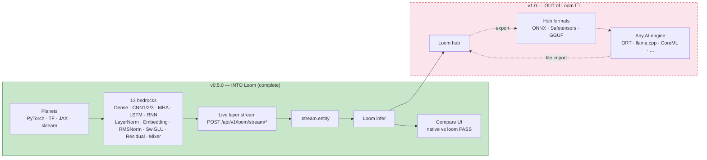
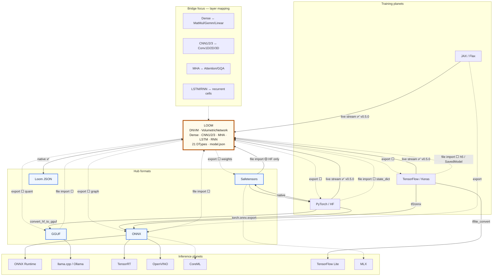

# Planet Bridging

**Universal bridging between AI engines through Loom.**

Each major AI runtime is a "planet" — PyTorch, TensorFlow, llama.cpp, ONNX Runtime, CoreML, and others each speak their own file formats, operator dialects, and execution models. Models don't travel freely; they get converted, lose fidelity, or stay locked to one engine.

This repo maps those planets, scopes their file formats, and builds bridges so models can flow **into Loom**, run on Loom's deterministic volumetric runtime, and (later) flow **back out** to other engines — without abandoning pure Go and zero CGO.

Research and format deep-dives live in [`rnd/`](./rnd/README.md). Architecture diagrams: [`BRIDGE.md`](./BRIDGE.md). Live scoreboard: [`PROGRESS.md`](./PROGRESS.md).

---

## Release — v0.5.0 (planets → Loom, complete)

**Planet Bridging v0.5.0** closes the **first half** of the hub: every standard Loom volumetric layer type has a live-stream bedrock that proves **planet → Loom** on shared fixtures. Thirteen compare tabs, twelve layer types, and **Mixer v2** chaining all of them in one 16-layer stack.

| | |
|---|---|
| **Version** | `0.5.0` ([`host/version.go`](./host/version.go)) |
| **Loom** | v0.79 — Dense, CNN1/2/3, MHA, LSTM, RNN, LayerNorm, Embedding, RMSNorm, SwiGLU, Residual, … |
| **This release** | **Into Loom only** — live weight stream → `.stream.entity` → Loom infer → compare vs native |
| **Not in v0.5.0** | File-based import without live Python, **Loom → any engine** export, bit-exact deep-stack determinism |

**v0.5.0 in one sentence:** thirteen compare tabs (dense · cnn1–3 · mha · lstm · rnn · layernorm · embedding · rmsnorm · swiglu · residual · mixer), three Python planets (plus sklearn on Dense), 100 shared test samples per model — native and Loom outputs match within fp32 tolerance (`< 1e-5`) on single-layer bedrocks; **Mixer v2** is POC (~5e-5 max diff, behaviour good enough for now).

**Next milestone — v1.0:** Loom → ONNX / Safetensors / GGUF → any inference engine. See [`PROGRESS.md`](./PROGRESS.md).

### Version roadmap (how we count halves)

Bidirectional bridging is two big arcs. We number them in **0.5 steps** so the version tells you which direction works:

| Version | Direction | What it means |
|---------|-----------|---------------|
| **0.4.0** | **Planets → Loom (partial)** | Compare host + original 7 layers + LayerNorm + Mixer v1 |
| **0.5.0** | **Planets → Loom (complete)** | All standard layer bedrocks + **Mixer v2** (12 types) — **this release** |
| **1.0.0** | **Loom → other AI engines** | Export from Loom → ONNX / Safetensors / GGUF → ORT, llama.cpp, CoreML, … — bidirectional hub |
| **1.x → 2.0** | **Everything we skipped** | File import without live Python, ConvTranspose / Softmax / …, more planets, lossy-path docs, polish |

So **0.5 + 0.5 ≈ 1.0** for the two directions (into Loom, then out of Loom); **1 → 2** is completeness beyond that.

---

## What works with what (v0.5.0)

Each cell is **native infer + live stream to Loom** on the same fixture. Compare labels: `PASS` / `EXACT` / `DIFF` — see [`PROGRESS.md`](./PROGRESS.md) for per-model detail.

| Loom layer | Bedrock | PyTorch | TensorFlow | JAX | sklearn | Loom stream | Loom compare |
|------------|---------|:-------:|:----------:|:---:|:-------:|:-----------:|:------------:|
| **Dense** | `python/dense/` | ✅ | ✅ | 🟡 | 🟡 | ✅ | 🟡 43/48 PASS |
| **CNN1** | `python/cnn1/` | ✅ | ✅ | ✅ | — | ✅ | ✅ 12/12 |
| **CNN2** | `python/cnn2/` | ✅ | ✅ | ✅ | — | ✅ | ✅ 12/12 |
| **CNN3** | `python/cnn3/` | ✅ | ✅ | ✅ | — | ✅ | ✅ 12/12 |
| **MHA** | `python/mha/` | ✅ | ✅ | ✅ | — | ✅ | ✅ 12/12 |
| **LSTM** | `python/lstm/` | ✅ | ✅ | ✅ | — | ✅ | ✅ 12/12 |
| **RNN** | `python/rnn/` | ✅ | ✅ | ✅ | — | ✅ | ✅ 12/12 |
| **LayerNorm** | `python/layernorm/` | ✅ | ✅ | ✅ | — | ✅ | ✅ 24/24 |
| **Embedding** | `python/embedding/` | ✅ | ✅ | ✅ | — | ✅ | ✅ 24/24 EXACT |
| **RMSNorm** | `python/rmsnorm/` | ✅ | ✅ | ✅ | — | ✅ | ✅ 24/24 |
| **SwiGLU** | `python/swiglu/` | ✅ | ✅ | ✅ | — | ✅ | ✅ 24/24 |
| **Residual** | `python/residual/` | ✅ | ✅ | ✅ | — | ✅ | ✅ 24/24 |
| **Mixer v1** | `python/mixer/` | ✅ | ✅ | ✅ | — | ✅ | ✅ 3/3 PASS (7 types) |
| **Mixer v2** | `python/mixer/` | ✅ | ✅ | ✅ | — | ✅ | 🟡 3/3 POC (~5e-5, 12 types) |

**Planets:** PyTorch · TensorFlow · JAX run all **live** bedrocks above. sklearn runs Dense only. Paddle is disabled.

**Mechanism (all layers):** Python reads **live in-memory weights** → JSON layer stream → Go `bridge.BuildNetworkFrom*Stream` → `.stream.entity` → Loom forward on shared `x_test`. This is **not** a training chain and **not** onnx → safetensors → loom.



View interactively: [mermaid.live](https://mermaid.live).

---

## Quick start — Python package (no HTTP)

Stream live weights into `.entity` from the command line or Python:

```bash
cd planetbridging
go build -o bin/loom-stream ./cmd/loom-stream/
pip install -e ".[pytorch]"

python examples/01_hello_stream.py          # one layer type
python examples/02_all_layer_types.py       # all 13 bedrocks
python examples/04_multi_layer_models.py    # 4-layer MLP, Mixer v2, …
```

See [`examples/README.md`](./examples/README.md) for the full list. Core API:

```python
from planetbridging import engines
result = engines.stream("mha", "pytorch")
print(result.native_vs_loom, result.entity_path)
```

---

## Quick start — compare host (HTTP dashboard)

```bash
cd planetbridging

# Compare host (pure Go, port 9876)
go run .
./killserver.sh                 # stop when done

# Open dashboard — 13 tabs (all standard layer bedrocks + mixer)
open http://localhost:9876/

# Run a bedrock (starts host if needed)
./python/dense/run_dense.sh
./python/cnn1/run_cnn1.sh
./python/mha/run_mha.sh
./python/lstm/run_lstm.sh
./python/rnn/run_rnn.sh
./python/layernorm/run_layernorm.sh
./python/embedding/run_embedding.sh
./python/rmsnorm/run_rmsnorm.sh
./python/swiglu/run_swiglu.sh
./python/residual/run_residual.sh
./python/mixer/run_mixer.sh          # mixer_all_v1 + mixer_all_v2
```

Dense also needs `./python/dense/setup_conda.sh` once. Each other bedrock creates its own `pb-<layer>-<engine>` conda env on first run.

`go run . host` is the same as `go run .`. Flags: `-addr :9876`, per-bedrock `-reports` / `-models` dirs — see [`main.go`](./main.go).

---

## What we're doing here

1. **Map the AI solar system** — catalog training frameworks, inference engines, and the file formats each planet uses.

2. **Prove planet → Loom (v0.5.0)** — for every standard Loom layer type, stream live weights into `.entity` and verify Loom matches native on shared fixtures. **Done (v0.5.0).**

3. **Loom → other engines (v1.0)** — the other half:
   - **Import** from checkpoint files (Safetensors, ONNX, GGUF, Keras, …) without a live Python planet
   - **Export** from Loom → hub formats → any inference engine
   - Round-trip where possible; document lossy paths where not

4. **Layer bedrocks — v0.5.0 (all standard types):**

   | Loom layer | Typical ops on other planets | Status |
   |------------|------------------------------|:------:|
   | **Dense** | `MatMul`/`Gemm`/`Linear` | ✅ |
   | **CNN1** | `Conv1d` | ✅ |
   | **CNN2** | `Conv2d` | ✅ |
   | **CNN3** | `Conv3d` | ✅ |
   | **MHA** | `MultiHeadAttention` (causal + RoPE POC) | ✅ |
   | **LSTM** | `LSTM` cell (i/f/g/o gates) | ✅ |
   | **RNN** | `RNN` / `SimpleRNN` (tanh) | ✅ |
   | **LayerNorm** | `LayerNormalization` | ✅ |
   | **Embedding** | `Embedding` lookup | ✅ |
   | **RMSNorm** | RMS normalization | ✅ |
   | **SwiGLU** | gated MLP (LLaMA-style) | ✅ |
   | **Residual** | skip connection | ✅ |
   | **Mixer** | integration stack | ✅ v1 PASS · v2 POC (~5e-5) |

   Later (v1.x–2.0): ConvTranspose 1/2/3, Softmax, Parallel, Sequential, KMeans, …

---

## Loom at the center — current state

Loom (v0.80) is a pure-Go Deterministic Neural Virtual Machine with native execution for Dense, CNN1/2/3, MHA, LSTM, RNN, and more across **21 DTypes**, with **`.entity`** native checkpoints and **JSON** debug persistence.

**Dtype reality check:** Python planets train in **FP32** (sklearn: FP64). Bedrock compares **float outputs at one precision** — not 21-type parity across engines. See [`python/dense/README.md`](./python/dense/README.md#numerical-types--planets-vs-loom-fml-tier).

| Direction | Status | Detail |
|-----------|--------|--------|
| **Loom JSON ↔ Loom** | ✅ Native | Full topology + weights; train, save, reload, infer (all 21 dtypes) |
| **Loom ENTITY ↔ Loom** | ✅ Native | `.entity` binary checkpoints (v0.80+); Lucy [7]/[8] validated |
| **Live planet stream → Loom** | ✅ v0.5.0 | Thirteen bedrock routes — `POST /api/v1/loom/stream/*` → `.stream.entity`; all standard volumetric types |
| **Safetensors → Loom** | 🟡 Partial | Native loader in main Loom tree; config-driven HF transformers only — not wired in compare-host |
| **ONNX / GGUF / `.pt` / Keras file → Loom** | ⬜ v1.x | Pure-Go file importers — bedrock checkpoints on disk today are export-fidelity checks |
| **Loom → Safetensors / ONNX / GGUF** | ⬜ v1.0 | Export — the other half of the hub |
| **Loom → PyTorch / Keras / ORT / llama.cpp** | ⬜ v1.0 | Likely via hub formats as intermediate |

**Release order:** **Loom v0.80** ships first (ENTITY + modern WebGPU). **Planet Bridging v0.5.0** publishes after that tag. **v1.0:** Loom → any engine. **v1.x–2.0:** file import, niche layers, tighter deep-stack determinism.

### Dense bedrock — stage 2 import targets

The Python bedrock has checkpoints on disk; **each format needs a pure-Go importer built from scratch**. Full file list, build order, effort tiers, and **stdlib-only feasibility** (topology + weights without third-party libs): [`python/dense/README.md#pure-go-stdlib-only--topology-and-weights-without-third-party-libs`](./python/dense/README.md#pure-go-stdlib-only--topology-and-weights-without-third-party-libs).

| Priority | Format | Planet | Stdlib-only? |
|----------|--------|--------|--------------|
| 1 | `.safetensors` + `manifest.yaml` | PyTorch export | ✅ weights + YAML topology |
| 2 | `.onnx` | PyTorch export | ✅ subset protobuf + graph |
| 3 | `.keras` | TensorFlow native | 🟡 topology yes; HDF5 weights hard |
| 4 | `saved_model/` | TensorFlow export | 🟠 defer |
| — | `.msgpack` / `.pkl` / `.pdparams` | JAX / sklearn / Paddle | Defer — export to hub first |

---

## Scoped AI engines and file formats

Consolidated from [`rnd/`](./rnd/README.md) research (ChatGPT, Google, Claude, Grok). Three **hub formats** sit between planets; most traffic routes through them.

### Hub formats (interchange layer)

| Format | Extension | Graph? | Role |
|--------|-----------|--------|------|
| **Safetensors** | `.safetensors` | No (weights + optional metadata) | HF/PyTorch weight distribution standard |
| **ONNX** | `.onnx` (+ `.data`) | Yes (protobuf graph) | Cross-framework graph interchange |
| **GGUF** | `.gguf` | Implicit (metadata KV) | llama.cpp / local LLM inference |
| **Loom JSON** | `model.json` | Yes (volumetric topology) | Loom native checkpoint |

### Training / source planets

| Engine | Primary formats | Notes |
|--------|-----------------|-------|
| **PyTorch** | `.pt`, `.pth`, `.bin` (pickle/ZIP), TorchScript `.pt`, → ONNX, → Safetensors | Dominant training stack; pickle is unsafe |
| **Hugging Face Transformers** | `.safetensors` + `config.json`, or `.bin` + config | Layout convention, not a single file format |
| **TensorFlow / Keras** | SavedModel (dir), `.ckpt`, `.h5`, `.keras`, GraphDef `.pb` | SavedModel checkpoint v2 is hardest in pure Go |
| **JAX / Flax** | Orbax dirs, `.npz`, msgpack | No fixed single-file standard |
| **MXNet** | `.json` + `.params` | Legacy (Apache Attic) |
| **PaddlePaddle** | `.pdmodel` + `.pdiparams` | paddle2onnx for escape |
| **Caffe** | `.prototxt` + `.caffemodel` | Legacy vision zoo |

### Inference / runtime planets

| Engine | Primary formats | Bridge strategy |
|--------|-----------------|-----------------|
| **Loom** | `model.json`, ingests Safetensors | **Hub — this repo** |
| **ONNX Runtime** | `.onnx`, `.ort` | Hub via ONNX; primary cross-planet target |
| **llama.cpp / Ollama / GPT4All** | `.gguf`, llamafile | Hub via GGUF |
| **TensorRT** | `.engine` | Runtime-locked; ONNX → trtexec only |
| **OpenVINO** | `.xml` + `.bin` | Conversion from ONNX |
| **CoreML** | `.mlmodel`, `.mlpackage` | Apple ANE; conversion from PyTorch/ONNX |
| **TensorFlow Lite** | `.tflite` | Mobile; TF/Keras → tflite_convert |
| **ExecuTorch** | `.pte` | PyTorch Edge; one-way from torch.export |
| **MLC-LLM** | MLC bundle dirs | Native compiled; skip direct bridge |
| **MLX** | Safetensors + MLX quant layout | Apple-local; safetensors hub |

### Secondary / lower-priority formats

Darknet (`.weights` + `.cfg`), NumPy (`.npy`/`.npz`), Flax msgpack, Orbax/Zarr, EXL2/EXL3, TVM `.tar` — surveyed in rnd; bridge when a focus-layer model needs them.

---

## Planet bridge diagram

Loom at the center. **Solid** = works today (partial or full). **Dashed** = unexplored / not built yet.



Legend: **✅** native · **🟡** partial · **⬜** unexplored (target of this repo)

View interactively: copy the diagram into [mermaid.live](https://mermaid.live).

---

## Universal planet bridging — the plan

The point of this repo is not to reimplement every engine. It is to make **Loom a bidirectional hub** for the layer types that matter most.

**v0.5.0 (this release) — planets → Loom complete:**

```
Planet (PyTorch / TF / JAX)  ──live stream──►  VolumetricLayer *  ──►  .entity  ──►  Loom infer  ──►  PASS vs native
```

**v1.0 (other half — Loom out):**

```
External planet                    Loom                         External planet
─────────────────    ─────────────────────────────    ─────────────────
PyTorch Dense    ──►  VolumetricLayer Dense      ──►  ONNX MatMul
Keras Conv2D     ──►  VolumetricLayer CNN2       ──►  GGUF
ONNX Attention   ──►  VolumetricLayer MHA        ──►  Safetensors + config
TF LSTM          ──►  VolumetricLayer LSTM       ──►  any inference engine
```

**Phased priorities** (see [`rnd/README.md`](./rnd/README.md) for detail):

| Phase | Work | Target version |
|-------|------|----------------|
| **A** | Live stream bedrocks — original 7 + LayerNorm + Mixer v1 | ✅ **0.4.0** |
| **A′** | Remaining layer bedrocks — Embedding, RMSNorm, SwiGLU, Residual, Mixer v2 | ✅ **0.5.0** |
| **B** | Loom → export (Safetensors, ONNX, GGUF) → inference planets | **1.0.0** |
| **C** | File-based import + Safetensors/GGUF/ONNX readers in compare-host | **1.x** |
| **D** | Niche layers (ConvTranspose, Softmax, …), more planets, hub polish | **1.x → 2.0** |

---

## Repo layout

| Path | Purpose |
|------|---------|
| [`host/`](./host/) | Compare dashboard HTTP server (`go run .`) — v0.5.0 |
| [`bridge/`](./bridge/) | Layer stream builders → `.entity`, fixtures, Loom infer (per layer type) |
| [`python/dense/`](./python/dense/) | Dense bedrock — 12 models × 4 planets |
| [`python/cnn1/`](./python/cnn1/) · [`cnn2/`](./python/cnn2/) · [`cnn3/`](./python/cnn3/) | Conv bedrocks — 4 models × 3 planets each |
| [`python/mha/`](./python/mha/) | MHA bedrock — causal + RoPE POC |
| [`python/lstm/`](./python/lstm/) · [`python/rnn/`](./python/rnn/) | Recurrent bedrocks |
| [`python/layernorm/`](./python/layernorm/) | LayerNorm bedrock |
| [`python/mixer/`](./python/mixer/) | All-layer integration bedrock |
| [`python/embedding/`](./python/embedding/) · [`rmsnorm/`](./python/rmsnorm/) · [`swiglu/`](./python/swiglu/) · [`residual/`](./python/residual/) | Norm / FFN / skip bedrocks — 4 models × 3 planets each |
| [`killserver.sh`](./killserver.sh) | Stop compare-host on `:9876` |
| [`BRIDGE.md`](./BRIDGE.md) | Architecture diagrams — step 1 vs bidirectional endgoal |
| [`PROGRESS.md`](./PROGRESS.md) | Live scoreboard — per-model PASS/DIFF |
| [`rnd/`](./rnd/) | Format research, pure-Go feasibility, roadmap |

---

## Related

- [Loom](../README.md) — the engine at the center
- [`rnd/README.md`](./rnd/README.md) — full format inventory, pure-Go feasibility, roadmap, "what comes close to Loom"
- [Loom serialization docs](../docs/serialization.md) — native `model.json` format
- [Loom bedrock validation](../docs/bedrock_validation.md) — seven-layer CPU suite (Dense, MHA, CNN1/2/3, RNN, LSTM, …)
