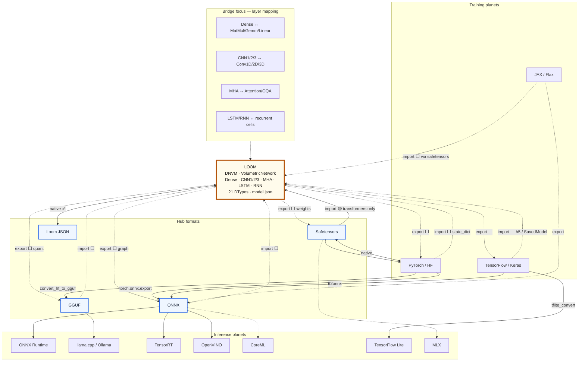

# Planet Bridging

**Universal bridging between AI engines through Loom.**

Each major AI runtime is a "planet" — PyTorch, TensorFlow, llama.cpp, ONNX Runtime, CoreML, and others each speak their own file formats, operator dialects, and execution models. Models don't travel freely; they get converted, lose fidelity, or stay locked to one engine.

This repo maps those planets, scopes their file formats, and builds **bidirectional bridges** so models can flow **into Loom**, run on Loom's deterministic volumetric runtime, and flow **back out** to other engines — without abandoning pure Go and zero CGO.

The dense bedrock Python layer is where that fracture is visible day to day: **five conda envs**, incompatible frameworks, shell glue — vs **`go run .`** for the compare host with zero external deps. See [`python/dense/README.md#why-conda-the-python-dependency-problem`](./python/dense/README.md#why-conda-the-python-dependency-problem).

Research and format deep-dives live in [`rnd/`](./rnd/README.md).

Architecture diagram (Python planets → numerics → Loom, step 1 vs bidirectional endgoal): [`BRIDGE.md`](./BRIDGE.md).

---

## Quick start — Dense tab

Each **planet** (TensorFlow, PyTorch, …) trains on the **same shared data**, then we compare steps in that planet's pipeline — not TensorFlow vs PyTorch:

**native** → **export** (SavedModel, ONNX, …) and **loom / entity** (live layer stream) — parallel paths; see [`PROGRESS.md`](./PROGRESS.md)

**Planet-side bedrock is done** for the current scope — five engines, twelve models, train/skip/report. See [`python/dense/README.md`](./python/dense/README.md) for layout, per-engine artifacts, run observations, conda/dependency reality, and the Go/Loom contrast.

```bash
cd planetbridging

# 1. Start the compare website (default port 9876)
go run .
./killserver.sh                 # stop it when done

# 2. Open http://localhost:9876/

# 3. Train planets and push pipeline reports
./python/dense/setup_conda.sh   # once
./python/dense/run_dense.sh     # all engines; starts host if needed
```

`go run . host` is the same as `go run .`. Flags: `-addr :9876`, `-reports python/dense/reports`.

---

## What we're doing here

1. **Map the AI solar system** — catalog the most popular training frameworks and inference engines, and the file formats each planet uses to store topology + weights.

2. **Build the bridge** — implement loaders, exporters, and conversion paths so Loom sits at the center as a hub, not a dead end.

3. **Bidirectional Loom I/O** — explore a planet-bridging layer in Loom that can:
   - **Import** from external engines (Safetensors, ONNX, GGUF, PyTorch, Keras, …) → Loom `VolumetricNetwork`
   - **Export** from Loom → external formats other engines can consume
   - Round-trip where possible; document lossy paths where not

4. **Focus on core layer types first** — universal bridging starts with the dense main layers Loom already executes natively:

   | Loom layer | Typical ops on other planets |
   |------------|------------------------------|
   | **Dense** | `MatMul`/`Gemm`/`FullyConnected` (ONNX), `nn.Linear` (PyTorch), `Dense` (Keras/TF) |
   | **CNN1** | `Conv1d` (PyTorch), `Conv1D` (Keras), `Conv` 1D (ONNX) |
   | **CNN2** | `Conv2d`, `Conv` 2D |
   | **CNN3** | `Conv3d`, `Conv` 3D |
   | **MHA** | `MultiHeadAttention`, `Attention`, `GroupQueryAttention` (ONNX/HF) |
   | **LSTM** | `LSTM` cell (ONNX/PyTorch/TF) |
   | **RNN** | `RNN`/`SimpleRNN` (ONNX/PyTorch/TF) |

   Transformer blocks (MHA + SwiGLU + RMSNorm) and vision stacks (CNN + Dense) are the first realistic cross-planet targets. Everything else layers on top.

---

## Loom at the center — current state

Loom (v0.79) is a pure-Go Deterministic Neural Virtual Machine with native execution for Dense, CNN1/2/3, MHA, LSTM, RNN, and more across **21 DTypes**, with bit-packed **`model.json`** persistence.

**Dtype reality check:** Python planets (PyTorch, TF, JAX, …) train almost exclusively in **FP32** (sklearn: FP64). They do not offer Loom-style per-layer dtype menus. Bedrock compares **float outputs at one precision** — not 21-type parity across engines. See [`python/dense/README.md`](./python/dense/README.md#numerical-types--planets-vs-loom-fml-tier).

| Direction | Status | Detail |
|-----------|--------|--------|
| **Loom JSON ↔ Loom** | ✅ Native | Full topology + weights; train, save, reload, infer (all 21 dtypes) |
| **Safetensors → Loom** | 🟡 Partial | Native loader; config-driven ingest for specific HF transformer families (MHA-heavy). Not yet generic for arbitrary Dense/CNN/RNN/LSTM checkpoints |
| **GGUF → Loom** | ⬜ Unexplored | Parsers exist in Go; no Loom bridge yet |
| **ONNX → Loom** | ⬜ Unexplored | Protobuf parse feasible; scoped op executor not wired |
| **PyTorch `.pt` → Loom** | ⬜ Unexplored | state_dict via allowlisted unpickler is feasible; no bridge yet |
| **Keras `.h5`/`.keras` → Loom** | ⬜ Unexplored | HDF5 in pure Go is now possible (`scigolib/hdf5`); no bridge yet |
| **TF SavedModel → Loom** | ⬜ Unexplored | Hard (SSTable checkpoint index); frozen GraphDef easier |
| **Loom → Safetensors** | ⬜ Unexplored | Export weights + sidecar config |
| **Loom → ONNX** | ⬜ Unexplored | Map volumetric layers → ONNX nodes |
| **Loom → GGUF** | ⬜ Unexplored | Metadata + quantized tensor writer |
| **Loom → PyTorch / Keras / TFLite** | ⬜ Unexplored | Likely via ONNX or Safetensors as intermediate |

**Goal:** fill the ⬜ cells for the focus layer types above, starting with **Dense + CNN + MHA + RNN + LSTM**.

### Dense bedrock — stage 2 import targets

The Python bedrock has checkpoints on disk; **each format needs a pure-Go importer built from scratch**. Full file list, build order, effort tiers, and **stdlib-only feasibility** (topology + weights without third-party libs): [`python/dense/README.md#pure-go-stdlib-only--topology-and-weights-without-third-party-libs`](./python/dense/README.md#pure-go-stdlib-only--topology-and-weights-without-third-party-libs).

| Priority | Format | Planet | Stdlib-only? |
|----------|--------|--------|--------------|
| 1 | `.safetensors` + `manifest.yaml` | PyTorch export | ✅ weights + YAML topology |
| 2 | `.onnx` | PyTorch export | ✅ subset protobuf + graph |
| 3 | `.keras` | TensorFlow native | 🟡 topology yes; HDF5 weights hard |
| 4 | `saved_model/` | TensorFlow export | 🟠 defer |
| — | `.msgpack` / `.pkl` / `.pdparams` | JAX / sklearn / Paddle | Defer — export to hub first |

---

## Scoped AI engines and file formats

Consolidated from [`rnd/`](./rnd/README.md) research (ChatGPT, Google, Claude, Grok). Three **hub formats** sit between planets; most traffic routes through them.

### Hub formats (interchange layer)

| Format | Extension | Graph? | Role |
|--------|-----------|--------|------|
| **Safetensors** | `.safetensors` | No (weights + optional metadata) | HF/PyTorch weight distribution standard |
| **ONNX** | `.onnx` (+ `.data`) | Yes (protobuf graph) | Cross-framework graph interchange |
| **GGUF** | `.gguf` | Implicit (metadata KV) | llama.cpp / local LLM inference |
| **Loom JSON** | `model.json` | Yes (volumetric topology) | Loom native checkpoint |

### Training / source planets

| Engine | Primary formats | Notes |
|--------|-----------------|-------|
| **PyTorch** | `.pt`, `.pth`, `.bin` (pickle/ZIP), TorchScript `.pt`, → ONNX, → Safetensors | Dominant training stack; pickle is unsafe |
| **Hugging Face Transformers** | `.safetensors` + `config.json`, or `.bin` + config | Layout convention, not a single file format |
| **TensorFlow / Keras** | SavedModel (dir), `.ckpt`, `.h5`, `.keras`, GraphDef `.pb` | SavedModel checkpoint v2 is hardest in pure Go |
| **JAX / Flax** | Orbax dirs, `.npz`, msgpack | No fixed single-file standard |
| **MXNet** | `.json` + `.params` | Legacy (Apache Attic) |
| **PaddlePaddle** | `.pdmodel` + `.pdiparams` | paddle2onnx for escape |
| **Caffe** | `.prototxt` + `.caffemodel` | Legacy vision zoo |

### Inference / runtime planets

| Engine | Primary formats | Bridge strategy |
|--------|-----------------|-----------------|
| **Loom** | `model.json`, ingests Safetensors | **Hub — this repo** |
| **ONNX Runtime** | `.onnx`, `.ort` | Hub via ONNX; primary cross-planet target |
| **llama.cpp / Ollama / GPT4All** | `.gguf`, llamafile | Hub via GGUF |
| **TensorRT** | `.engine` | Runtime-locked; ONNX → trtexec only |
| **OpenVINO** | `.xml` + `.bin` | Conversion from ONNX |
| **CoreML** | `.mlmodel`, `.mlpackage` | Apple ANE; conversion from PyTorch/ONNX |
| **TensorFlow Lite** | `.tflite` | Mobile; TF/Keras → tflite_convert |
| **ExecuTorch** | `.pte` | PyTorch Edge; one-way from torch.export |
| **MLC-LLM** | MLC bundle dirs | Native compiled; skip direct bridge |
| **MLX** | Safetensors + MLX quant layout | Apple-local; safetensors hub |

### Secondary / lower-priority formats

Darknet (`.weights` + `.cfg`), NumPy (`.npy`/`.npz`), Flax msgpack, Orbax/Zarr, EXL2/EXL3, TVM `.tar` — surveyed in rnd; bridge when a focus-layer model needs them.

---

## Planet bridge diagram

Loom at the center. **Solid** = works today (partial or full). **Dashed** = unexplored / not built yet.



Legend: **✅** native · **🟡** partial · **⬜** unexplored (target of this repo)

View interactively: copy the diagram into [mermaid.live](https://mermaid.live).

---

## Universal planet bridging — the plan

The point of this repo is not to reimplement every engine. It is to make **Loom a bidirectional hub** for the layer types that matter most:

```
External planet                    Loom                         External planet
─────────────────    ─────────────────────────────    ─────────────────
PyTorch Dense    ──►  VolumetricLayer Dense      ──►  ONNX MatMul
Keras Conv2D     ──►  VolumetricLayer CNN2       ──►  GGUF (future)
ONNX Attention   ──►  VolumetricLayer MHA        ──►  Safetensors + config
TF LSTM          ──►  VolumetricLayer LSTM       ──►  Loom JSON (native)
```

**Pipeline (from rnd consensus):**

1. **Detect** format (extension + magic bytes)
2. **Parse** natively in Go where feasible (Safetensors, ONNX protobuf, GGUF, HDF5, allowlisted pickle)
3. **Build** a universal topology AST — explicit graph (ONNX) or heuristic from tensor names + config (Safetensors/GGUF)
4. **Map** AST nodes → Loom focus layers (Dense, CNN1/2/3, MHA, LSTM, RNN)
5. **Execute** on Loom; optionally **export** back through the reverse mapping

**Phased priorities** (see [`rnd/README.md`](./rnd/README.md) for detail):

| Phase | Work | Unlocks |
|-------|------|---------|
| 1 | Safetensors read/write + sharded index | HF weight hub in/out |
| 2 | GGUF reader + key dequant types | llama.cpp planet |
| 3 | ONNX parse + scoped LLM/CNN op set | ONNX Runtime planet |
| 4 | Focus-layer mappers (Dense, CNN, MHA, LSTM, RNN) | Universal bridging for core layers |
| 5 | Loom → export (Safetensors, ONNX) | Bidirectional hub |

---

## Repo layout

| Path | Purpose |
|------|---------|
| [`host/`](./host/) | Compare dashboard HTTP server (`go run .`) |
| [`python/dense/`](./python/dense/) | Multi-engine dense bedrock — see [`python/dense/README.md`](./python/dense/README.md) |
| [`killserver.sh`](./killserver.sh) | Stop compare-host on `:9876` |
| [`BRIDGE.md`](./BRIDGE.md) | Mermaid diagrams — planets, numerics, Loom hub; step 1 vs bidirectional endgoal |
| [`rnd/`](./rnd/) | Automated R&D — format specs, feasibility, source PDFs, consolidated research |
| [`PROGRESS.md`](./PROGRESS.md) | What works / what does not — updated layer-by-layer |
| [`bridge/`](./bridge/) | Dense layer stream → `.entity`, fixture load, infer (live stream POC) |

---

## Related

- [Loom](../README.md) — the engine at the center
- [`rnd/README.md`](./rnd/README.md) — full format inventory, pure-Go feasibility, roadmap, "what comes close to Loom"
- [Loom serialization docs](../docs/serialization.md) — native `model.json` format
- [Loom bedrock validation](../docs/bedrock_validation.md) — seven-layer CPU suite (Dense, MHA, CNN1/2/3, RNN, LSTM, …)
