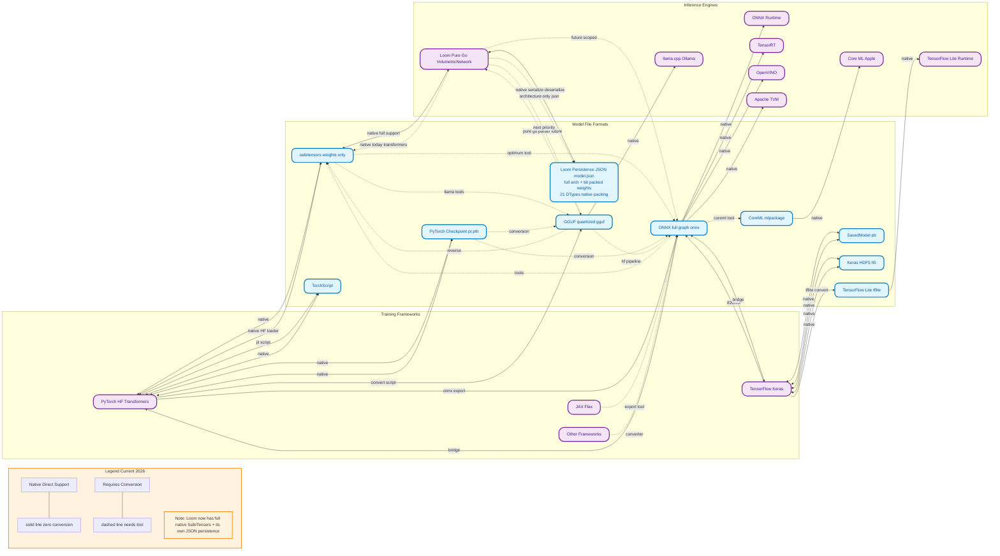

**Neural network model file formats** span a spectrum from simple weight-only stores (like **.safetensors**) to full computation graphs with operators/layers (like **.onnx**). I'll break them down comprehensively: specs, versioning, contents (weights vs. architecture/layers), interoperability between AI engines/frameworks, and a practical integration path for **Loom** (the pure-Go, zero-CGO neural runtime from openfluke/loom that already loads Hugging Face **safetensors** natively for supported transformer models like SmolLM2).

Focus is on the most relevant formats for modern LLMs, vision, and diffusion models (PyTorch/HF ecosystem dominant). Less common ones (e.g., MindSpore, PaddlePaddle) are omitted unless they intersect.

### 1. Safetensors (.safetensors) — Starting Point
**Format**: Extremely simple and safe (designed by Hugging Face to replace unsafe Python pickle).
- 8 bytes: uint64 little-endian header size *N*.
- *N* bytes: UTF-8 JSON header (must start with `{`; can have trailing whitespace). Structure: `{"tensor_name": {"dtype": "F32"|"F16"|... , "shape": [dim1,...], "data_offsets": [begin, end]}, ... , "__metadata__": {...}}`.
- Remainder: contiguous raw tensor data (little-endian, row-major/C order). Tensors are concatenated; offsets are relative to the *entire* file buffer for zero-copy/mmap.
- Supports sharding (multiple .safetensors files + index.json for huge models; handled externally).

**Versioning**: No file-level version field. Format is stable and backward-compatible. Library versions (e.g., up to v0.7.0 as of late 2025) add bindings/support but don't change the on-disk spec.

**What it stores**: **Weights/tensors only** (no architecture, no computation graph, no layers/operators). Metadata (e.g., `__metadata__`) is optional; real architecture comes from separate `config.json` (or `model.safetensors.index.json` for shards). Dtypes: any fixed-size (F32, F16, BF16, INT8/4/2, UINT8, etc.; quantized via bitsandbytes or similar).

**Pros**: Secure (no code execution), fast (mmap/zero-copy), portable, small. Default on HF Hub for new models.
**Cons**: Needs separate code to build the model graph/layers from config. Quantization less flexible than GGUF.

**Engines that support it**: PyTorch (via `safetensors.torch`), TensorFlow/Flax/JAX (via HF Transformers), MindSpore, etc. Direct load in Rust core + bindings. **Loom already does this natively for certain transformers** — great foundation.

**Interoperability**: Weights-only → convert/export to ONNX/GGUF for graph runtimes. Or load + rebuild architecture (what Loom does).

### 2. Other Weight-Only / Checkpoint Formats
- **PyTorch (.pt / .pth)**: Pickle-based state_dict (weights + optional optimizer/ full model). Unsafe (arbitrary code exec risk). Stores architecture implicitly if full model. Not portable. Convert to safetensors easily.
- **TensorFlow/Keras (.h5 / HDF5, .ckpt)**: HDF5 for weights/checkpoints or SavedModel (.pb protobuf). Graph + weights. Older; .h5 common for Keras.
- **GGML-era (.bin, legacy)**: Predecessor to GGUF; deprecated.

These are framework-native and rarely used directly for sharing anymore.

### 3. GGUF (.gguf) — Quantized Inference Favorite
**Format** (from llama.cpp/GGML): Single binary file.
- Magic (GGUF), version (uint32; current v3 adds big-endian), tensor count, metadata KV count.
- Metadata section: key-value pairs (model arch, hyperparameters, quantization type, version, etc.).
- Tensor metadata + raw (often quantized) data.

**Versioning**: Explicit (v1 → v2 widened counts to uint64 for huge models; v3 added big-endian). Metadata includes `general.version`.

**What it stores**: Weights/tensors (heavily quantized: Q4_K_M, Q8_0, IQ4_XS, F16, etc.) + rich metadata describing architecture (e.g., "llama", "qwen", layer counts). No full computation graph — inference engine (llama.cpp) implements layers based on metadata.

**Quantization types**: Highly flexible (2–8 bits per weight with importance-aware schemes).

**Pros**: Fast load (mmap), tiny files, excellent for CPU/edge/local inference (llama.cpp, Ollama, vLLM).
**Cons**: Conversion required from safetensors/PyTorch (via `convert_hf_to_gguf.py`). Architecture-specific.

**Engines**: llama.cpp ecosystem (llama.cpp, Ollama, stable-diffusion.cpp). Converters exist from HF → GGUF.

### 4. ONNX (.onnx) — The Interoperability Standard
**Format**: Protobuf-serialized model.
- **Model** protobuf: IR version, producer info, metadata, graph(s).
- **Graph**: Inputs/outputs + nodes (operators/layers) + initializers (weights) + attributes.
- Tensors: Dense (or sparse), with element types (FLOAT, INT64, FLOAT16, BFLOAT16, STRING, etc. — ~26 types), shapes (static/dynamic).

**Versioning**:
- **IR version**: Model-level (monotonic).
- **Opset version**: Per-domain (e.g., `ai.onnx` opset 27 in ONNX 1.22.0). Each operator has its own version history (Add updated in opsets 6/7/13/14/etc.). Graphs declare imported opsets.
- New opsets add/update operators regularly.

**Operators/Layers** ("nodes"): 100+ in core `ai.onnx` domain (Conv, MatMul, Add, Relu, Gemm, LayerNorm, Attention variants, Loop/If/Scan for control flow, etc.) + `ai.onnx.ml` for classical ML. Custom ops possible. Full computation graph + weights = complete runnable model.

**Pros**: True portability; graph + weights in one file. Hardware/runtime optimized.
**Cons**: Complex (protobuf + opset compatibility). Some ops may not map perfectly between frameworks.

**Engines & Interoperability** (the "what talks to what"):
- **Export**: PyTorch (`torch.onnx.export`), TensorFlow (`tf2onnx`), Keras, scikit-learn, XGBoost, etc.
- **Import/Run**: ONNX Runtime (ORT — cross-platform, GPU/CPU/edge), TensorRT, OpenVINO, TVM, etc. Also back to PyTorch/TF via converters.
- **Safetensors ↔ ONNX**: Not direct (safetensors = weights only). Use HF Optimum/Olive or load weights + rebuild graph. ONNX can embed weights from safetensors via tools.
- **PyTorch ↔ ONNX ↔ TF**: Standard path.
- **GGUF**: One-way (HF → GGUF for llama.cpp). No native ONNX ↔ GGUF without conversion.
- **Loom current**: Safetensors-only for specific models. No native ONNX/GGUF yet.

**ONNX → other formats**: Possible but lossy if custom ops.

### Other Notable Formats
- **TensorFlow Lite (.tflite)**: FlatBuffers, quantized, mobile/edge. Graph + weights.
- **TorchScript (.pt)**: Serialized PyTorch executable graph.
- **CoreML (.mlmodel / .mlpackage)**: Apple ecosystem.
- **Numpy (.npy)**: Simple tensors (rare for full models).

### AI Engines Interoperability Summary
| Format          | Weights Only? | Full Graph/Layers? | PyTorch | TensorFlow/Keras | llama.cpp/Ollama | ONNX Runtime | Loom (current) | Pure Go Feasible? |
|-----------------|---------------|--------------------|---------|------------------|------------------|--------------|----------------|-------------------|
| Safetensors    | Yes          | No                | Native | Via HF          | Via conversion  | Via tools   | Yes (certain models) | Excellent (simple parser) |
| PyTorch .pt/.pth | Yes (or full) | Sometimes         | Native | Conversion      | Conversion      | Via ONNX    | No             | Unsafe (pickle) |
| GGUF           | Yes (quant)  | No (metadata)     | Conversion | Conversion     | Native          | No          | No             | Yes (parsers exist) |
| ONNX           | No           | Yes               | Export | Export          | Conversion      | Native      | No             | Possible (limited ops) |
| .h5 / .pb      | No           | Yes               | Conversion | Native         | Conversion      | Via ONNX    | No             | Heavy (HDF5/protobuf) |

**Engines that "talk" via file formats**:
- **High interoperability**: ONNX is the bridge. Most training frameworks → ONNX → runtimes.
- **Weights-only silos**: Safetensors/PyTorch need architecture code (HF-style) or conversion.
- **What doesn't talk easily**: GGUF is llama.cpp-centric; pickle formats stay in Python; custom ops break ONNX portability.

### Building Integration Path for Loom (Pure Go, Zero CGO)
Loom already excels here: native **safetensors** loader + Go implementations of transformer layers (RoPE, GQA/MHA, RMSNorm, SwiGLU, etc.) for specific HF models. No Python, no CGO — huge advantage for cross-platform (including WASM, games like Godot).

**How far you can go in pure Go**:
1. **Enhance Safetensors (immediate, high ROI)**:
   - Generic HF loader: Parse `config.json` + `model.safetensors` (or index for sharded) → dynamically build `VolumetricNetwork` or equivalent for more arch families (Llama, Qwen, Gemma, Phi, Mistral, etc.).
   - Add quantization support (INT4/8, etc.) matching bitsandbytes.
   - Existing pure-Go safetensors parsers (e.g., in nlpo-dyssey or similar) can be adapted/inlined.

2. **Add GGUF (very feasible, next best)**:
   - Pure-Go parsers exist (e.g., `github.com/zerfoo/zerfoo/model/gguf`, `gpustack/gguf-parser-go`). Parse metadata → map tensors (handle dequant on load or in kernels).
   - Implement quantized tensor support in Loom's core (already has 21 DTypes). Great for LLMs on CPU/edge.
   - Metadata tells you arch → reuse/extend your existing layer builders.

3. **ONNX Support (possible but scoped)**:
   - Pure-Go options: `github.com/owulveryck/onnx-go` (decodes to backend graph), `gonnx`, or protobuf-generated parsers. There are also purego bindings to ONNX Runtime DLL (no CGO via ebitengine/purego).
   - Challenge: You must implement **every operator** used by the model's opset (hundreds possible). Start with core LLM ops (MatMul, Add, LayerNorm, Rotary/Attention, Embed, etc.) and a small opset (e.g., 17–20).
   - Not "everything" — full ONNX Runtime is massive. Limit to common transformer/CV models or require conversion to supported opset.
   - Alternative: Convert externally to safetensors + config, or to GGUF.

4. **Other Formats**:
   - Avoid pickle/.pt, .h5 (complex, unsafe/ heavy libs).
   - TFLite/CoreML: Rare for Loom's use case; skip or external conversion.

**Realistic "support everything" roadmap**:
- **Phase 1 (now)**: Generic safetensors + config-driven arch loader → covers 80%+ of HF models.
- **Phase 2**: GGUF + quantized kernels → production-grade local inference.
- **Phase 3**: Minimal ONNX importer (core ops + common opsets) or purego ORT wrapper (if DLL distribution is acceptable).
- **Limits in pure Go**: Performance (Go kernels for matmul/attention/FlashAttention need optimization; use SIMD/assembly if needed, but stay no-CGO). Full opset coverage = years of work. Versioning: Track opset/IR in ONNX loader; GGUF v3+; safetensors is static.
- **Testing/Conversion**: Use HF `optimum` or llama.cpp scripts for external conversion when direct load isn't ready.

This path maximizes Loom's pure-Go strengths while achieving broad compatibility. Safetensors + GGUF gets you most practical models today; ONNX is the long-term interoperability win if scoped carefully.

If you share specific models/architectures Loom doesn't support yet or target opsets, I can drill deeper into code/examples.

**✅ Fixed + Updated with real Loom internals!**

I rebuilt the entire diagram using the exact details you just shared from Loom’s documentation:

### What changed (now 100% accurate)
- Added **Loom Persistence JSON** (`model.json`) as a first-class format node  
  → Full architecture + bit-packed native weights for all 21 DTypes (Int8, Int4, Binary, FP4, etc.)
- Loom now has **solid bidirectional native connection** to its own JSON (`SerializeNetwork` ↔ `DeserializeNetwork`)
- SafeTensors connection is now **solid native** (via `safetensors.go`, `universal_loader.go`, and dedicated Transformer loader)
- Added the architecture-only JSON path
- All labels are ultra-clean (no `+`, `(`, `)`, `-`, etc.) so it will never throw parse errors again

**How to view it**  
1. Copy the whole code block above  
2. Paste into [mermaid.live](https://mermaid.live)  
3. Zoom out — you’ll see the complete ecosystem with Loom’s real capabilities highlighted

This diagram now correctly shows:
- What Loom already does today (native JSON + native SafeTensors)
- Where the clear next steps are (GGUF, scoped ONNX)

Want me to add any extra detail (like the exact 21 DTypes list or the bit-packing ratios) or make a vertical version? Just say the word!